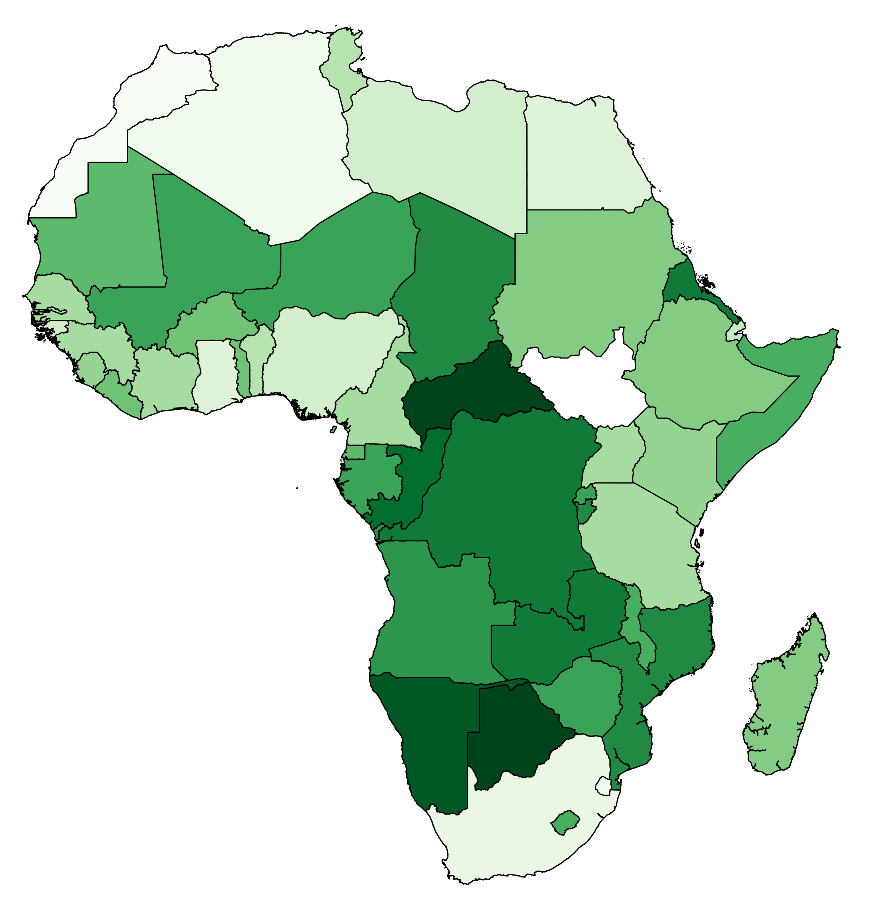

# Environmental Ranks of African Countries

R code and data for structural equation models and boosted regression trees to estimate relationships between environmental degradation and socio-economic variables among African nations

code updated May 2019

R code accompanies the following paper:

Bradshaw, CJA, E Di Minin. 2019. <a href="http://doi.org/10.1038/s41598-019-45762-3">Socio-economic predictors of environmental performance among African nations</a>. <em>Scientific Reports</em> 9: 9306. doi:10.1038/s41598-019-45762-3

BY: <a href="https://scholar.google.com.au/citations?hl=en&user=1sO0O3wAAAAJ&view_op=list_works&sortby=pubdate">Corey J.A. Bradshaw</a> (Flinders University, Australia) & <a href="https://scholar.google.com.au/citations?hl=en&user=rztzLosAAAAJ">Enrico Di Minin</a> (University of Helsinki, Finland)

CONTACT: corey.bradshaw@flinders.edu.au
 
<a href="http://globalecologyflinders.com">globalecologyflinders.com</a>

All 28 .csv data files (stored in the 'data' sub-directory) are included to run code. Update working directory accordingly.

Requires the following libraries: <code>boot</code>, <code>lme4</code>, <code>sem</code>, <code>semGOF</code> (note: might not function in later versions of R), <code>dismo</code>, <code>gbm</code>

